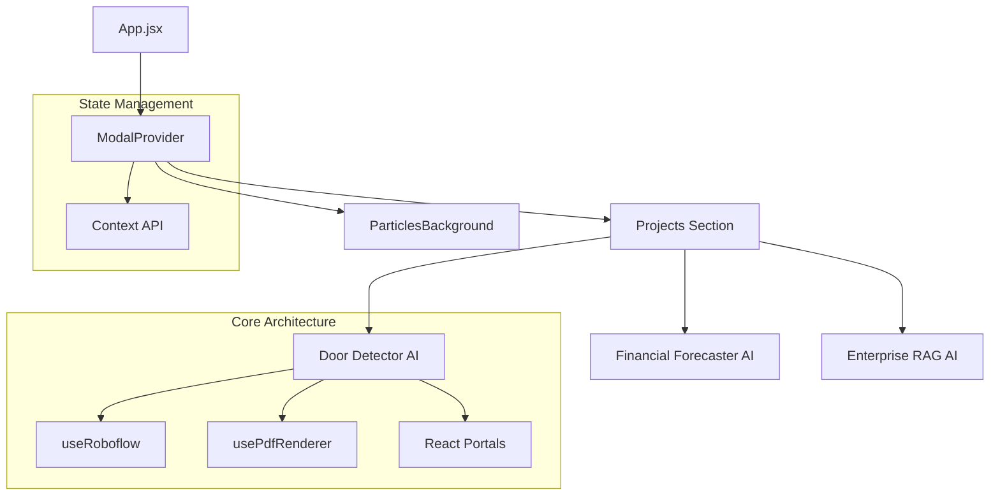

# 🌌 Leonardo Nieto Cortés | Portfolio & AI Solutions

[](https://reactjs.org/)
[](https://vitejs.dev/)
[](https://tailwindcss.com/)
[](https://opensource.org/licenses/MIT)
[](https://Portafolio234.github.io/1)

Este es un portafolio de ingeniería de software de alto rendimiento, diseñado como una **Single Page Application (SPA)** moderna que integra soluciones reales de Inteligencia Artificial.

---

## 🏗️ Arquitectura del Sistema

El proyecto sigue principios de **Clean Code** y una arquitectura desacoplada basada en componentes modulares y hooks personalizados.



### 💎 Características de Ingeniería

- **React Portals**: Gestión de modales fuera del árbol jerárquico del DOM para evitar conflictos de apilamiento (z-index).
- **Custom Hooks**: Abstracción de lógica compleja (PDF rendering, API calls) para maximizar la reutilización.
- **Context API**: Manejo de estado global para una experiencia de usuario fluida y sin "prop drilling".
- **Optimización 120Hz**: Animaciones de partículas optimizadas para pantallas de alta frecuencia.

---

## 🤖 Showcase de IA

### 🗺️ Detector de Puertas Arquitectónico

- **Tecnología**: Computer Vision con Roboflow API.
- **Funcionalidad**: Renderizado de planos PDF complejos en Canvas y detección en tiempo real de elementos mediante IA.
- **Reto Técnico**: Procesamiento de archivos PDF pesados y mapeo de coordenadas IA sobre lienzos dinámicos.

### 📈 AI Financial Forecaster

- **Tecnología**: Plotly.js + Groq IA (Llama 3).
- **Funcionalidad**: Análisis predictivo de mercados financieros con chat contextual que entiende los datos actuales del gráfico.

---

## 🛠️ Stack Tecnológico

| Capa | Tecnologías |
| :--- | :--- |
| **Frontend** | React 18, Vite |
| **Estilos** | Tailwind CSS 3.4, Vanilla CSS Animations |
| **IA/ML** | Roboflow API, Groq Cloud (LLMs) |
| **Visualización** | Plotly.js, HTML5 Canvas |
| **Documentación** | Mermaid.js, Markdown |

---

## 🚀 Guía de Inicio Rápido

### Requisitos Previos

- Node.js (v18+)
- NPM o Yarn

### Instalación

1. **Clonar y entrar al directorio:**

   ```bash
   git clone https://github.com/Portafolio234/1.git
   cd 1
   ```

2. **Configurar el entorno:**
   Crea un archivo `.env` en la raíz con las siguientes llaves (puedes solicitarlas en sus respectivos sitios):

   ```env
   VITE_ROBOFLOW_API_KEY=tu_api_key_aqui
   GROQ_API_KEY=tu_api_key_aqui
   ```

3. **Instalar y correr:**

   ```bash
   npm install
   npm run dev
   ```

---

## 🤝 Contribución

Si quieres mejorar algo:

1. Fork el proyecto.
2. Crea una rama (`git checkout -b feature/MejoraIncreible`).
3. Commit tus cambios (`git commit -m 'Añadida mejora funcional'`).
4. Push a la rama (`git push origin feature/MejoraIncreible`).
5. Abre un Pull Request.

---

## 📄 Licencia

Este proyecto está bajo la Licencia MIT. Siéntete libre de usarlo como inspiración.

---
*Desarrollado con ❤️ por Leonardo Nieto Cortés*
